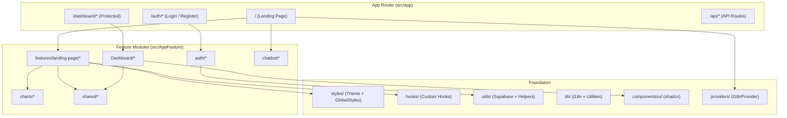

<](https://nextjs.org/)
[](https://react.dev/)
[](https://www.typescriptlang.org/)
[](https://supabase.com/)
[](https://styled-components.com/)
[](https://tailwindcss.com/)

<br />

A comprehensive, bilingual (English / Arabic) health & nutrition SaaS platform featuring an AI-powered food scanner, real-time macro tracking, interactive dashboards, coach booking, workout planning, and community engagement — all wrapped in a premium dark glassmorphism UI.

<br />

[Getting Started](#-getting-started) · [Features](#-features) · [Tech Stack](#-tech-stack) · [Architecture](#-architecture) · [Scripts](#-available-scripts)

</div>

---

## ✨ Features

### 🏠 Landing Page
| Feature | Description |
|---------|-------------|
| **Hero Section** | Animated hero with live macro-tracking mockup, calorie ring, floating badges, and CTA |
| **Sponsor Carousel** | Trusted-by brand logos section |
| **Feature Showcase** | Grid of platform capabilities with in-view scroll animations |
| **Analytics Dashboard Preview** | Weight progress chart, weekly calories chart, macro donut chart, and metric cards |
| **How It Works** | Step-by-step guided walkthrough |
| **Coaches Section** | Browse and book certified nutrition coaches |
| **Pricing Plans** | Tiered subscription cards with feature comparison |
| **Testimonials** | User reviews and success stories |
| **Mobile App Preview** | Promotional section for the mobile experience |
| **Call-to-Action** | Final conversion section with sign-up prompt |

### 📊 Dashboard
| Feature | Description |
|---------|-------------|
| **Overview** | Calorie intake/burn stats, weight tracking, weekly streak counter |
| **Calories & Burned Chart** | Dual-axis recharts visualization of intake vs. expenditure |
| **Water Intake Tracker** | Daily hydration monitoring |
| **Sleep Tracker** | Sleep duration and quality tracking |
| **Run & Steps** | Activity and step count monitoring |
| **AI Recommendations** | Smart health and nutrition suggestions |
| **Today's Meals** | Real-time daily meal log with macro breakdown |
| **BMI Calculator** | Interactive body mass index calculator with status classification |
| **AI Food Scanner** | Upload or capture food photos for nutritional analysis |
| **Workout Planner** | Daily workout routines and exercise tracking |
| **Progress Tracking** | Historical health metrics with visual progress charts |
| **Coach Booking** | Schedule sessions with health & nutrition coaches via modal |
| **Community Hub** | Social features and community engagement |
| **Settings** | Profile management and app preferences |
| **Upgrade Plan** | Premium subscription upsell with plan comparison |

### 🤖 AI Chatbot
- Floating launcher with dynamic import (zero initial bundle cost)
- Animated panel open/close transitions
- Conversational interface with bot/user message bubbles
- Auto-scroll to latest message
- Localized responses

### 🌍 Internationalization (i18n)
- Full **English** and **Arabic** language support
- RTL layout auto-switching for Arabic
- Sidebar position flips based on language direction
- All UI text extracted to JSON translation files

### 🔐 Authentication
- **Login** and **Registration** with multi-step sign-up
- Zod schema validation (email, password, weight, height, birth date, gender, goals, health conditions)
- Supabase Auth with SSR session management via `proxy.ts`
- Server-side and client-side Supabase client utilities

### 🎨 Design System
- Premium **dark glassmorphism** UI with gradient overlays
- Custom theme system (`theme.ts`) with curated color palette
- Styled-components SSR registry for flicker-free rendering
- Animated scrollbar with gradient thumb
- Custom 404 page with decorative rings, gradient text, and meta bar

---

## 🛠 Tech Stack

### Core

| Category | Technology |
|----------|------------|
| **Framework** | Next.js 16.2 (App Router) |
| **Language** | TypeScript 5 |
| **Runtime** | React 19.2 |

### Styling & UI

| Category | Technology |
|----------|------------|
| **CSS-in-JS** | Styled-Components 6 |
| **Utility CSS** | Tailwind CSS 4 |
| **Component Library** | shadcn/ui (Radix UI primitives) |
| **Icons** | Lucide React, React Icons |
| **Animations** | Framer Motion 12, CSS keyframe animations |
| **Design Tokens** | Custom theme object + CSS custom properties |

### Data & Backend

| Category | Technology |
|----------|------------|
| **Database & Auth** | Supabase (Auth + SSR) |
| **SSR Auth** | `@supabase/ssr` with Next.js `proxy.ts` |
| **API** | Next.js API Routes |

### Forms & Validation

| Category | Technology |
|----------|------------|
| **Forms** | React Hook Form 7 |
| **Schema Validation** | Zod 4 |
| **Resolver** | `@hookform/resolvers` |

### Charts & Data Visualization

| Category | Technology |
|----------|------------|
| **Chart Library** | Recharts 3 |
| **Chart Types** | Area charts, donut charts, bar charts |
| **Custom Tooltips** | Themed `ChartTooltip` component |

### Internationalization

| Category | Technology |
|----------|------------|
| **i18n** | i18next + react-i18next |
| **Detection** | i18next-browser-languagedetector |
| **Languages** | English (`en`), Arabic (`ar`) |

### Tooling

| Category | Technology |
|----------|------------|
| **Bundler** | Turbopack (Next.js built-in) |
| **Linting** | ESLint 9 |
| **Bundle Analysis** | `@next/bundle-analyzer` |
| **Class Merging** | `clsx` + `tailwind-merge` |
| **Variant Management** | `class-variance-authority` |

---

## 📁 Project Structure

```
nutriai/
├── public/                          # Static assets (favicon)
├── src/
│   ├── app/                         # Next.js App Router
│   │   ├── api/                     # API routes
│   │   │   ├── Login/               # Login API
│   │   │   └── Register/            # Registration API
│   │   ├── auth/                    # Auth pages (login, register)
│   │   ├── dashboard/               # Dashboard routes
│   │   │   ├── book-coach/          # Coach booking page
│   │   │   ├── community/           # Community hub
│   │   │   ├── food-log/            # Food logging + scanner
│   │   │   ├── profile/             # User profile
│   │   │   ├── progress/            # Progress tracking
│   │   │   ├── upgradePlan/         # Subscription upgrade
│   │   │   ├── workouts/            # Workout planner
│   │   │   ├── layout.tsx           # Dashboard shell layout
│   │   │   └── page.tsx             # Dashboard overview
│   │   ├── Languages/               # i18n JSON files (en, ar)
│   │   ├── Schemes/                 # Zod validation schemas
│   │   ├── globals.css              # Tailwind + shadcn theme
│   │   ├── layout.tsx               # Root layout (fonts, providers)
│   │   ├── not-found.tsx            # Custom 404 page
│   │   └── page.tsx                 # Landing page
│   │
│   ├── AppFeature/                  # Feature modules
│   │   ├── auth/                    # Auth UI (login, register forms)
│   │   ├── charts/                  # Landing page charts
│   │   │   ├── MacroDonutChart/
│   │   │   ├── WeeklyCaloriesChart/
│   │   │   └── WeightProgressChart/
│   │   ├── chatbot/                 # AI chatbot (lazy-loaded)
│   │   ├── Dashboard/               # Dashboard feature modules
│   │   │   ├── Overview/            # KPI cards, charts, BMI, meals
│   │   │   ├── BookCoash/           # Coach booking + modal
│   │   │   ├── Community/           # Community features
│   │   │   ├── FoodLog/             # Food scanner
│   │   │   ├── Progress/            # Progress tracking
│   │   │   ├── Settings/            # User settings
│   │   │   ├── UpgradePlan/         # Plan upgrade
│   │   │   ├── workout/             # Workout planner
│   │   │   ├── DashboardShell.tsx   # Dashboard wrapper (sidebar + header)
│   │   │   └── app-sidebar.tsx      # Sidebar navigation
│   │   ├── features/landing-page/   # Landing page sections
│   │   │   ├── Hero/
│   │   │   ├── Analytics/
│   │   │   ├── Features/
│   │   │   ├── HowItWorks/
│   │   │   ├── Coaches/
│   │   │   ├── Pricing/
│   │   │   ├── Testimonials/
│   │   │   ├── MobilePreview/
│   │   │   ├── Sponsers/
│   │   │   └── CTA/
│   │   └── shared/                  # Reusable UI components
│   │       ├── Button/
│   │       ├── Footer/
│   │       ├── GlassCard/
│   │       ├── Modal/
│   │       ├── Navbar/
│   │       ├── SectionTitle/
│   │       └── LazySection.tsx
│   │
│   ├── components/                  # shadcn/ui components
│   │   ├── charts/                  # Chart theme + tooltip
│   │   └── ui/                      # Button, Card, Sidebar, etc.
│   │
│   ├── data/                        # Static data modules
│   ├── hooks/                       # Custom React hooks
│   ├── lib/                         # Utilities (i18n, cn)
│   ├── providers/                   # Context providers (I18nProvider)
│   ├── store/                       # State management (reserved)
│   ├── styles/                      # Global styles, theme, animations
│   ├── types/                       # TypeScript type definitions
│   ├── utils/                       # Utility functions + Supabase clients
│   └── proxy.ts                     # Next.js 16 request proxy (auth)
│
├── next.config.ts                   # Next.js configuration
├── tsconfig.json                    # TypeScript configuration
├── components.json                  # shadcn/ui configuration
├── eslint.config.mjs                # ESLint configuration
├── postcss.config.mjs               # PostCSS configuration
└── package.json
```

---

## 🚀 Getting Started

### Prerequisites

- **Node.js** ≥ 18.x
- **npm** ≥ 9.x (or equivalent package manager)
- **Supabase** project with Auth enabled

### Installation

```bash
# Clone the repository
git clone https://github.com/your-username/nutriai.git
cd nutriai

# Install dependencies
npm install
```

### Environment Variables

Create a `.env.local` file in the project root:

```env
NEXT_PUBLIC_SUPABASE_URL=your_supabase_project_url
NEXT_PUBLIC_SUPABASE_PUBLISHABLE_KEY=your_supabase_publishable_key
```

> [!IMPORTANT]
> Never commit `.env.local` to version control. The `.gitignore` already excludes it.

### Development

```bash
npm run dev
```

The app will start at [http://localhost:3000](http://localhost:3000).

### Production Build

```bash
npm run build
npm start
```

---

## 📸 Screenshots

> Screenshots coming soon. Run the project locally to explore the full experience.

<!-- Uncomment and replace with actual screenshots:
| Landing Page | Dashboard | Food Scanner |
|:---:|:---:|:---:|
|  |  |  |
-->

---

## 🎯 Architecture

NutriAI follows a **feature-based modular architecture** built on top of the Next.js 16 App Router.



### Key Design Decisions

- **Feature Colocation**: Each feature (Hero, Analytics, Dashboard Overview) contains its own `index.tsx`, `styles.ts`, and data — keeping related code together
- **Dual Styling**: Styled-components for feature modules (CSS-in-JS with theme access) + Tailwind for utility classes and shadcn/ui components
- **SSR Compatibility**: Custom `StyledComponentsRegistry` ensures zero-FOUC styled-components rendering with Next.js streaming
- **Proxy-based Auth**: Supabase session refresh via Next.js 16 `proxy.ts` (replaces deprecated `middleware.ts`)

---

## ⚡ Performance Optimizations

| Optimization | Implementation |
|-------------|----------------|
| **Dynamic Imports** | All landing page sections below the fold are loaded via `next/dynamic` |
| **Lazy Section Rendering** | `LazySection` component uses `IntersectionObserver` to defer rendering until the section is near the viewport |
| **Code Splitting** | Chatbot is fully code-split via `dynamic()` with `ssr: false` — zero cost until user interaction |
| **Package Import Optimization** | `optimizePackageImports` in `next.config.ts` for Framer Motion, Recharts, Radix UI, Lucide, React Icons, and Supabase |
| **Bundle Analysis** | `@next/bundle-analyzer` integrated with `ANALYZE=true` flag |
| **SSR Style Injection** | `StyledComponentsRegistry` uses `useServerInsertedHTML` for streaming-compatible style injection |
| **Scroll-triggered Animations** | `useInViewAnimation` hook uses native `IntersectionObserver` — disconnects after trigger for zero runtime overhead |
| **Memoized Calculations** | BMI calculator uses `useCallback` to prevent unnecessary recalculations |
| **Font Optimization** | Google Fonts (Outfit, Syne, Geist) loaded via `next/font` with CSS variable injection |
| **Text Rendering** | `optimizeLegibility`, antialiased font smoothing enabled globally |

---

## 🔒 Security

| Feature | Details |
|---------|---------|
| **Authentication** | Supabase Auth with server-side session validation |
| **Session Refresh** | Automatic cookie-based session refresh via `proxy.ts` on every request |
| **Server/Client Separation** | Separate Supabase clients for server components (`server.ts`) and browser (`client.ts`) |
| **Input Validation** | Zod schemas validate all auth forms (email, password, biometric data, health conditions) |
| **Environment Variables** | Secrets stored in `.env.local`, excluded from version control |
| **Route Protection** | Proxy intercepts all non-static routes for auth verification |

---

## 🌍 Browser Support

| Browser | Supported |
|---------|-----------|
| Chrome 90+ | ✅ |
| Firefox 90+ | ✅ |
| Safari 15+ | ✅ |
| Edge 90+ | ✅ |
| Mobile Safari (iOS 15+) | ✅ |
| Chrome Android | ✅ |

> Requires browsers with support for `IntersectionObserver`, CSS `backdrop-filter`, and ES2017+.

---

## 📦 Available Scripts

| Script | Command | Description |
|--------|---------|-------------|
| **Dev** | `npm run dev` | Start development server with Turbopack |
| **Build** | `npm run build` | Create optimized production build |
| **Start** | `npm start` | Serve the production build |
| **Lint** | `npm run lint` | Run ESLint across the codebase |
| **Analyze** | `npm run analyze` | Generate bundle analysis report |

---

## 🤝 Contributing

Contributions are welcome! Please follow these steps:

1. **Fork** the repository
2. **Create** a feature branch (`git checkout -b feature/amazing-feature`)
3. **Commit** your changes (`git commit -m 'feat: add amazing feature'`)
4. **Push** to the branch (`git push origin feature/amazing-feature`)
5. **Open** a Pull Request

> Please ensure your code follows the existing patterns and passes `npm run lint` before submitting.

---

## 📄 License

This project is **proprietary**. All rights reserved. Unauthorized reproduction, distribution, or modification is strictly prohibited.

---

## 👨‍💻 Author

<div align="center">

**Built with 💚 for the MENA health & wellness community**

[](https://github.com/ahmedgouda5)

</div>

---

<div align="center">

<sub>NutriAI — Empowering healthier lives through intelligent nutrition technology.</sub>

</div>
]]>
